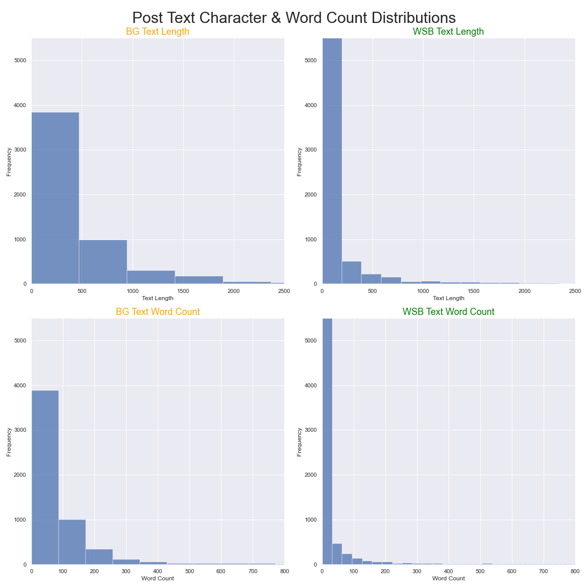

# Project 1: Reddit: Web API & NLP

## Table of Contents
- [Project 1: Reddit: Web API \& NLP](#project-1-reddit-web-api--nlp)
  - [Table of Contents](#table-of-contents)
  - [Overview](#overview)
  - [Problem-Statement](#problem-statement)
  - [Datasets](#datasets)
  - [Analysis Summary](#analysis-summary)
    - [Overall Data Analysis](#overall-data-analysis)
    - [Highest Engagement User's Analysis](#highest-engagement-users-analysis)
  - [Conclusion \& Recommendation](#conclusion--recommendation)

## Overview
"ADme" is conducting research on how to target subreddit on famous reddit social media with 50 million users efficiently/effectively. They have 3 stage iteration of research which includes building model, based on analysis build survey and last stage create targeted advertisement in subreddit.  

Data Analysis has been conducted using following libraries:
  - `pandas`
  - `numpy`
  - `seaborn`
  - `matplotlib`
  - `skylearn`
    - `BaggingClassifier`
    - `RandomForestClassifier`
    - `ExtraTreesClassifier`
    - `GradientBoostingClassifier`
    - `AdaBoostClassifier`
    - `VotingClassifier`
    - `StackingClassifier`
    - `confusion_matrix`
    - `ConfusionMatrixDisplay`
    - `classification_report`
    - `RocCurveDisplay`
    - `accuracy_score`
    - `Pipelin`
    - `train_test_split`
    - `GridSearchCV`
    - `cross_val_score`
    - `cross_val_predict`
    - `make_column_transformer`
    - `StandardScaler`
    - `MultinomialNB`
    - `LogisticRegression`
    - `KNeighborsClassifier`
    - `CountVectorizer` 
    - `TfidfVectorizer`
  - `nltk`
    - `SentimentIntensityAnalyzer`
    - `PorterStemmer`

## Problem-Statement
"ADme" acquired our team to help them with stage 1 process to give recommendations on how to build surveys based on analysis. In order to make any recommendation, we need to correctly classify posts by their subreddit. Create Natural Language Processing to create Classifier models. Create analysis and give suggestions on what type of words need to be used to make surveys that will catch engagement by subreddit users which will lead to gain behavioral data for stage 3.

## Datasets
| Features     | Data Types | Description                   |
| :----------- | :--------- | :---------------------------- |
| selftext     | object     | Post body text                |
| title        | object     | Post title                    |
| score        | int64      | User upvote to downvote ratio |
| domain       | object     | Subreddit domain              |
| id           | object     | User unique identification    |
| author       | object     | Username                      |
| num_comments | int64      | Number of comments            |
| url          | object     | Url used on a post            |
| created_utc  | int64      | Post posted timestamp         |
| subreddit    | int64      | Subreddit name                |

---

## Analysis Summary

### Overall Data Analysis

Model `performance` comparison to determine which model should be picked for modeling

Chart shows `board games` subreddit uses more words compare to `wall street bets`

Top 15 words used by `boardgames` subreddit

Top 15 words used by `wall street bets` subreddit

Combination of top 15 words from both subreddits combined to illustrate the words they share

Emoji use in a post distribution

Sentiment analysis per subreddit

Number of posts distribution by weekday

----
### Highest Engagement User's Analysis

Top 15 words used by `boardgames` subreddit

Top 15 words used by `wall street bets` subreddit

Combination of top 15 words from both subreddits combined to illustrate the words they share

Number of posts distribution by weekday

----
## Conclusion & Recommendation

**ADme** tasked to create models to classify subreddit post based on the subreddit it belongs. The main goal is to make targeted ads to posts that has highest engagement. Using best practices and state of the art NLP we have reached one of the best models we have seen so far.

- Stage 1:
    - Cleanup & EDA:
      - We have identified from the scrapped dataset during cleanup, many of the posts were missing `body` text. To tackle this issue, we have combined `body` and `title` text to avoid `null` values and called new entry as `subreddit_text`.
      - Stripped and cleaned all non alphanumeric values
      - Calculated `length` and `word-count` for `subreddit_text`
      - Counted number of emojis used in a text 
    - Preprocessing & Modeling:
      - Based on all the modeling that has been conducted `VotingClassifier` performed best by injecting best estimators from individual models:
       - `MultinomialNB`
         - [94/93] 
         - [Confidence Interval: 93.32 ± 0.02] 
       - `LogisticRegression` 
         - [97/94]
         - [Confidence Interval: 93.94 ± 0.01]
       - `RandomForest` 
        - [83/83]
         - [Confidence Interval: 82.93 ± 0.02]

As the initial stage of configuring model, we have decided to create classification model to correctly identify which post belongs to subreddit in simulated unseen data. Model's accuracy 95.2%, Specificity 92% and Sensitivity 97%. Since models performing well, we are ready to move on to Stage 2 of the process. Our recommendation includes:
  - Use following words to create interactive survey to collect behavioral scoring from both subreddit:
    - ['market', 'reddit',  'year', 'stock', 'twitter', 'loss', 'price', 'get', 'help', 'day', 'youtube', 'discord', 'would', 'wiki', 'go', 'play']
  - Post it on `Wednesday` or `Friday` to get possible highest engagement
  - Survey topic ['trade']